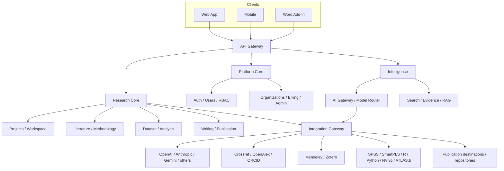

# MetodePenelitian.com Master Backend Architecture

**Status:** Draft v1.0 — Architecture reference, no implementation yet
**Owner:** Platform Architecture
**Scope:** Backend system design only. No code, no migrations, no APIs implemented by this document.

MetodePenelitian.com is positioned as a **Research Operating System**: the backend that follows a research project from idea to published output, powered by a **Multi-Model Research AI**, connected to the outside world through a **Research Integration Platform**, and ending each project's lifecycle at a **Publication Gateway**.

---

## 1. Purpose

This document is the single source of truth for MetodePenelitian.com's backend architecture. It exists to:

- Lock the conceptual architecture before any backend code is written.
- Give every future engineering decision (schema, service boundary, provider integration) a shared reference to check against.
- Prevent premature complexity: no microservices, no unverified integration claims, no speculative infrastructure.
- Define what is P0 (must exist to launch) versus P1–P3 (deliberately deferred).

Nothing in this document is a promise of a shipped feature. It is a map of what the system is allowed to become, and in what order.

---

## 2. Product Context

MetodePenelitian.com is not a single tool — it is four systems fused around one aggregate, the `ResearchProject`:

| Layer | Role |
|---|---|
| **Research Operating System** | The project-centric backbone: every research artifact (literature, methodology, dataset, analysis, writing) lives inside a `ResearchProject` and moves through a defined lifecycle. |
| **Multi-Model Research AI** | A provider-agnostic AI layer. Users get AI capability without owning API keys; the platform routes each task to the model best suited for it. |
| **Research Integration Platform** | A gateway that connects the project to the outside research world — reference managers, scholarly databases, statistical software, writing tools — without ever coupling Research Core to a specific vendor. |
| **Publication Gateway** | The exit path: matching a finished project to real journals/conferences/repositories and handing off to the *official* submission destination — never a fake in-house publisher. |

The user-facing promise: a researcher can move from a blank idea to a submission-ready manuscript without leaving the platform's context, while every AI answer, every literature suggestion, and every analysis stays grounded in *that specific project*.

---

## 3. Architectural Principles

These are binding. Any future design that contradicts one of these needs an explicit, documented exception.

1. `ResearchProject` is the central aggregate — everything else hangs off it.
2. All AI providers share the same Project Context. No model gets a private view of the project.
3. The frontend never talks to a third-party provider directly.
4. All AI calls pass through the AI Gateway.
5. All third-party services pass through the Integration Gateway.
6. Any provider (AI, scholarly, reference manager, publication) can be replaced without touching Research Core.
7. Research projects are private by default.
8. AI answers must be evidence-aware whenever the task requires evidence (citations, literature, statistics).
9. Heavy or slow work runs through the async job system, never inline on a request.
10. No microservices until there is a real scaling reason to split.
11. Start as a modular monolith with clean internal boundaries.
12. Services may be extracted later if load demands it — not before.
13. Any third-party repository pulled in for reference is reference-only until formally audited.
14. No integration is described as production-ready unless its API/terms have been verified.
15. The Publication Gateway is a router to real publishers — it is never itself a publisher.
16. Scopus, SINTA, and Google Scholar are indexing/discovery signals, not direct submission destinations.
17. Prefer interoperable, open standards (RIS, BibTeX, CSL, DOI) over proprietary lock-in.
18. Avoid vendor lock-in on AI providers, storage, and search.
19. API credentials and secrets never reach the client.
20. Every major operation is observable and auditable.

---

## 4. System Context Diagram



This is the only diagram every subsequent section's architecture must remain consistent with.

---

## 5. High-Level Backend Architecture

```
CLIENTS
   │
Web / Mobile / Word Add-in
   │
   ▼
API GATEWAY
   │
   ├── PLATFORM CORE ─── Auth, Users, RBAC, Organizations, Billing, Admin, Notifications
   ├── RESEARCH CORE ──── Projects, Workspace, Literature, Methodology, Dataset, Analysis,
   │                      Writing, Publication
   └── INTELLIGENCE ───── Research AI, Model Router, Search, Evidence, Advisors, RAG
                              │
                              ▼
                     INTEGRATION GATEWAY
                              │
   ┌─────────┬──────────┬──────────┬─────────┬───────────┬──────────┐
   │         │          │          │         │           │          │
 OpenAI  Anthropic   Gemini    Crossref  OpenAlex    ORCID      Mendeley
   │
   ├── Zotero          ├── SPSS            ├── Microsoft 365
   ├── DOAJ             ├── SmartPLS        ├── Google Workspace
   ├── SINTA            ├── AMOS            ├── NVivo
   ├── GARUDA           ├── R               ├── ATLAS.ti
   ├── Scopus/Elsevier  ├── Python          └── future providers
   ├── OJS              └── repositories
```

Modular monolith: one deployable backend, internally organized into the modules above with hard boundaries enforced at the code-module level (Section 22 covers the async layer, Section 19 the outbound gateway).

---

## 6. Research Core

**WHAT** — The project-centric backbone. `ResearchProject` is the aggregate root that owns every research artifact a user produces.

**WHY** — Without a single owning aggregate, literature, datasets, and writing become disconnected records and AI cannot reason about "this project" — only about isolated documents.

**MAIN COMPONENTS**
- `ResearchProject` service (create, update, archive, lifecycle transitions)
- Sub-resource services: Literature, Methodology, Dataset, Analysis, Writing, Publication — each scoped to a project
- Lifecycle state machine (Section 6.1)

**DATA OWNED** — `ResearchProject`, `ResearchStage`, `ResearchQuestion`, `ResearchObjective`, `Hypothesis`, `Variable`, `Construct`, `Indicator`, `Methodology`, `Population`, `Sample`, `Instrument`.

**DEPENDENCIES** — Platform Core (ownership/RBAC), Project Context Engine (Section 7), Integration Gateway (for literature/reference sync).

**SECURITY CONSIDERATIONS** — Project-level access control (owner, collaborators, institution admin visibility); private-by-default; row-level tenant isolation for institution-owned projects.

**PRIORITY** — P0.

### 6.1 Research Lifecycle

```
IDEA → LITERATURE → METHODOLOGY → DATA COLLECTION → ANALYSIS → WRITING
     → PUBLICATION READY → SUBMITTED → REVIEW → REVISION → ACCEPTED → PUBLISHED
```

A `ResearchProject` holds a current `ResearchStage` plus a full stage-transition history. Stage transitions are advisory (an AI/UI signal), not hard gates — a user is never blocked from working out of order.

### 6.2 What a ResearchProject can hold

title, topic, research problem, research questions, objectives, hypotheses, variables, constructs, indicators, theoretical framework, conceptual framework, methodology, population, sample, sampling, instruments, literature, files, datasets, analyses, documents, references, AI conversations, publication records.

### 6.3 P0 Research Execution IP

Three extension-compatible capabilities are locked as P0 parts of Research Core's execution fabric:

1. **Research Digital Twin** — the versioned, auditable, project-scoped graph of research entities, relationships, dependencies, provenance, validations, and changes. `ResearchProject` remains the aggregate root; the Twin is its canonical living research state, not a competing project or chatbot memory.
2. **Research Compiler / Consistency Engine** — validates structural, methodological, evidence, statistical, citation, ethics, and publication consistency against a pinned Twin version, producing `PASS`, `WARNING`, `ERROR`, `BLOCKED`, or `UNKNOWN` plus explainable issues and non-gamified Research Health.
3. **End-to-End Research Execution Pipeline** — the official 27-stage workflow from Research Intake through Publication Record. Stages may loop, but all accepted changes are versioned in the Twin, compiled, and subject to human gates.

Two supporting P0 capabilities are **Evidence-to-Claim Graph**, which traces major claims to papers, datasets, analysis results, methodology, and citations, and **Next Best Research Action Engine**, which proposes safe, explainable next actions from current state and unresolved risk without mutating state.

**Dependency propagation:** an upstream change calculates a project-scoped impact set and applies declared `INVALIDATE`, `REVIEW`, `RECOMPUTE`, `BLOCK`, or `NOTIFY` policies. It preserves historical versions and never performs an autonomous destructive replacement.

`BLOCK` applies to accepting an invalid downstream state, protected transitions, or publication/external gates; it does not turn the lifecycle into a forced linear wizard. Users may continue exploratory work out of order, with stale/invalid state visibly labeled.

**Human authority:** changing methodology, replacing hypotheses, changing population/sample, modifying a final instrument, overwriting a dataset, replacing final analysis/manuscript, changing publication target, external submission, and publication of research data require explicit approval. Agents may propose, explain, and preview only.

**Locked contract:** `ResearchProject`, Project Context Engine, Research Digital Twin, Research Compiler, AI Gateway, Agent Orchestrator, Integration Gateway, and Publication Gateway are binding. No provider-specific logic enters Research Core; no agent owns a silo database; the frontend never calls a provider directly; the Twin never depends on one AI provider.

Detailed contracts: [Research Digital Twin](architecture/RESEARCH%20DIGITAL%20TWIN.md), [Research Compiler](architecture/RESEARCH%20COMPILER.md), [End-to-End Research Execution](architecture/END%20TO%20END%20RESEARCH%20EXECUTION.md), [Research Execution Agent Contract](agents/RESEARCH%20EXECUTION%20AGENT%20CONTRACT.md), and [Idea-to-Publication Pipeline](workflows/IDEA%20TO%20PUBLICATION%20PIPELINE.md).

---

## 7. Project Context Engine

**WHAT** — A single, canonical context object per project that every AI model reads from. Not a chatbot memory — a structured, queryable snapshot of the project's current state.

**WHY** — The Research AI must never behave like a stateless chatbot. Claude, GPT, Gemini, or any future provider must see the *same* project reality — same research questions, same variables, same literature, same analysis results — or answers diverge and contradict each other across models.

**MAIN COMPONENTS**
- `ProjectContext` builder (assembles context from Research Core + Library + Datasets + Documents on demand)
- Context versioning (context snapshot tied to the AI request that used it, for reproducibility/audit)
- Context size management (summarization/windowing for long-context vs short-context models — handled inside the AI Gateway, not per-provider)

**DATA OWNED** — `ProjectContext` (derived/materialized view; source of truth remains Research Core entities).

**CONTEXT INCLUDES** — project identity, research stage, topic, research questions, objectives, variables, hypotheses, methodology, papers, references, datasets, analysis results, documents, publication target, AI conversation history.

**DEPENDENCIES** — Research Core (source data), AI Gateway (consumer).

**SECURITY CONSIDERATIONS** — Context assembly must respect the same access control as the underlying project; context sent to external AI providers must exclude fields the user has not consented to share (see Section 26).

**PRIORITY** — P0.

**Binding rule:** no provider adapter, no model, and no orchestrator path may construct its own private context. There is exactly one context builder.

---

## 8. Research AI Architecture

**WHAT** — The orchestration layer above the AI Gateway. This is "Research AI" as the user experiences it — not a raw model, but a research-aware agent with tools.

**WHY** — Raw LLM access answers questions; Research AI needs to *act* inside a project: search literature, recommend a method, run a calculator, check publication readiness.

**MAIN COMPONENTS**
- Capability set: Ask Research, Generate Research Ideas, Find Research Gap, Review Literature, Compare Papers, Explain Methods, Recommend Method, Recommend Sampling, Recommend Analysis, Analyze Results, Explain Statistics, Review Writing, Research Critic, Publication Advisor.
- Tool-calling layer with tools: `search_papers()`, `lookup_doi()`, `search_knowledge()`, `get_project_context()`, `get_references()`, `recommend_method()`, `recommend_analysis()`, `run_calculator()`, `analyze_dataset()`, `generate_citation()`, `find_journal()`, `check_publication_readiness()`.
- Conversation manager (`AIConversation`/`AIMessage`, scoped to a project).

**DATA OWNED** — `AIConversation`, `AIMessage` (tool calls and results logged per message).

**DEPENDENCIES** — AI Gateway (Section 9), Project Context Engine (Section 7), Knowledge & Search (Section 10), Literature & Evidence (Section 11), Dataset & Analysis (Section 13).

**SECURITY CONSIDERATIONS** — Tool authorization per role/plan; every tool call audited; no tool may write to a project the requesting user cannot access.

**PRIORITY** — P0 (core capability set), P1 (Compare Papers, Research Critic depth), P2 (Publication Advisor depth).

---

## 9. Multi-Model AI Gateway

This is the platform's central strategic architecture. Users are never required to hold their own provider API key.

**WHAT** — A provider-agnostic gateway that accepts a task, classifies it, routes it to the best available model, normalizes the response, and meters usage — all centrally funded by the platform.

**WHY** — Locking to one AI vendor is a business and technical risk. Different tasks (long-context literature synthesis vs. statistical reasoning vs. writing review) genuinely need different models. Centralizing the gateway lets the platform swap/add providers without touching any calling code.

**MAIN COMPONENTS**

| Component | Responsibility |
|---|---|
| `AIProviderRegistry` | Known providers (OpenAI, Anthropic, Gemini, DeepSeek, Mistral, Perplexity, Groq, future) |
| `AIModelRegistry` | Known models per provider |
| `AIModelCapabilities` | Per-model metadata: context size, multimodal, structured output, cost, latency class |
| `AIProviderAdapter` | Normalizes each provider's request/response shape |
| `AITaskClassifier` | Labels an incoming request by task type and complexity |
| `AIModelRouter` | Selects target model: AUTO or explicit user choice |
| `AIRequestManager` | Issues the call, applies timeout/retry |
| `AIResponseNormalizer` | Converts provider-specific responses into one internal shape |
| `AIUsageMeter` | Tracks tokens/requests per user/org |
| `AICostTracker` | Tracks internal provider cost (never exposed raw to the user) |
| `AIQuotaManager` | Enforces plan entitlements |
| `AIFallbackManager` | Reroutes to a healthy alternate model on provider failure |
| `AIProviderHealth` | Live health/circuit-breaker state per provider |
| `AIRequestAudit` | Immutable log of AI requests for audit/debugging |

**Flow**

```
User → Research AI → AI Gateway → Task Classifier → Model Router
     → Provider Adapter → Model → Normalized Response → Research AI → Project Context
```

**Model selection** — `AUTO` (platform decides) or explicit (`GPT`, `Claude`, `Gemini`, `DeepSeek`, etc). Routing may weigh: task type, reasoning complexity, context size, multimodal need, structured-output need, latency, cost, provider health, user plan. Example routing intent (not a hard rule): literature synthesis → long-context model; statistical interpretation → reasoning model + analysis tools; writing review → writing/reasoning-strong model.

**User-facing controls** — "Write with Claude", "Review with GPT", "Compare with Gemini", "Auto Select".

**Compare AI** — one logical request fanned out to multiple models; results compared on methodological correctness, evidence quality, citation quality, argument consistency, completeness, hallucination risk. Output is a structured comparison, not a merged answer.

**Bring Your Own API Key** — optional, advanced. If enabled: credentials are encrypted at rest, never stored plaintext, never sent to the frontend, and never written to logs.

**DATA OWNED** — `AIProvider`, `AIModel`, `AIModelCapability`, `AIRequest`, `AIResponse`, `AIUsage`, `AIRoutingPolicy`.

**DEPENDENCIES** — Integration Gateway (Section 19) for outbound provider calls, Billing (Section 27) for quota enforcement.

**SECURITY CONSIDERATIONS** — Provider credentials (platform-owned and BYOK) held in a secrets vault, never in application logs; per-request audit trail; prompt injection isolation for tool-calling (Section 26).

**PRIORITY** — P0 (gateway, router, AUTO selection, core providers), P1 (Compare AI, BYOK, secondary providers).

---

## 10. Knowledge & Search

**WHAT** — The platform's own research-methodology knowledge base, plus the search/indexing infrastructure that makes it (and papers, and projects) findable.

**WHY** — Research AI's advisory answers should be grounded in curated methodology content, not purely generative guesses. Search is also the backbone for literature discovery.

**MAIN COMPONENTS**
- Knowledge CMS (authoring/editing knowledge-base articles)
- Taxonomy Engine (topics: Research Fundamentals, Research Process, Research Design, Quantitative, Qualitative, Mixed Methods, Sampling, Measurement, Instruments, Statistics, Analysis, Academic Writing, Research Ethics, Research Dictionary, Software Guides)
- Metadata/tags/relationship graph
- Search indexing: full-text search, autocomplete, ranking, filters
- Semantic/vector search, RAG pipeline

**Relationship layer** — Method ↔ Research Design ↔ Variable ↔ Statistical Test ↔ Sampling ↔ Software ↔ Paper ↔ Dataset ↔ Template.

**DATA OWNED** — Knowledge articles, taxonomy nodes, tag graph, search indices (derived).

**DEPENDENCIES** — Search index infra (Section 21), Vector DB (Section 21), consumed by Research AI (Section 8) and Literature & Evidence (Section 11).

**SECURITY CONSIDERATIONS** — Knowledge content is public-readable; CMS write access restricted to CMS Admin role; search must not leak private-project content across tenants.

**PRIORITY** — P0 (full-text search, taxonomy, core knowledge base), P1 (semantic/vector search, RAG).

---

## 11. Literature & Evidence

**WHAT** — Discovery, ingestion, and canonicalization of scholarly literature from external providers, plus the user's personal library on top of it.

**WHY** — Evidence-aware AI answers and methodology recommendations require a reliable, deduplicated, citation-grade reference layer — not scraped or unverified data.

### 11.1 Scholarly Discovery

Provider tiers:
- **P0/P1 core:** Crossref, OpenAlex
- **P1/P2:** DOAJ, ORCID, SINTA, GARUDA, Scopus/Elsevier (only if legal access is available)
- Google Scholar: only through a legal/authorized provider path — never an unofficial scraper as a production foundation.

**Canonical entity — `ResearchReference`**

```
id, title, authors, abstract, year, doi, issn, journal, publisher, volume, issue,
pages, keywords, topics, citation_count, source, external_ids, open_access, url,
pdf_url_if_legal, metadata_source, last_verified_at
```

Deduplication key: DOI → title+authors+year → external identifiers, in that priority order.

### 11.2 Research Library

User-facing personal library: papers, collections, tags, notes, attachments, PDFs, references, saved searches. Actions: Save to Project, Add Notes, Tag, Archive, Compare, Cite, Ask Research AI.

**DATA OWNED** — `ResearchReference`, `Author`, `Journal`, `PaperCollection`, `PaperNote`, `PaperAttachment`.

**DEPENDENCIES** — Integration Gateway → Scholarly providers (Crossref, OpenAlex, etc.), Object Storage (attachments), Knowledge & Search (indexing).

**SECURITY CONSIDERATIONS** — Respect provider licensing on PDF redistribution; never surface a `pdf_url_if_legal` unless open-access/legal status is verified per record; attachment upload validation.

**PRIORITY** — P0 (Crossref/OpenAlex, core library), P1 (ORCID, DOAJ, SINTA, semantic dedup), P2 (Scopus/Elsevier if access secured).

---

## 12. Reference Manager Architecture

**WHAT** — An abstraction layer that lets a `ResearchReference` sync with external reference managers, without Research Core knowing which manager is in use.

```
                   ResearchReference
                          │
            Reference Manager Gateway
                │                 │
             Mendeley           Zotero
```

**Mendeley** — OAuth/API where the current official API supports it; import library; map references; deduplication; project association; citation workflow; write-back only where the official API permits it.

**Zotero** — OAuth/API; library, collections, items, tags, attachments, metadata; write operations only where authorized.

**Standards support (required regardless of provider API status)** — RIS import/export, BibTeX import/export, EndNote XML where feasible.

**Constraint** — any older Mendeley or third-party repository code found online is reference implementation only, never a production dependency, until formally audited.

**DATA OWNED** — sync mappings/link tables between `ResearchReference` and each provider's native IDs; no duplication of the canonical reference record.

**DEPENDENCIES** — Integration Gateway, Literature & Evidence (Section 11).

**SECURITY CONSIDERATIONS** — OAuth tokens encrypted at rest; per-provider rate-limit compliance; write-back operations gated behind explicit user confirmation.

**PRIORITY** — P1.

---

## 13. Dataset & Analysis

**WHAT** — Ingestion, cleaning, and statistical analysis of research datasets, plus an advisor that recommends the right analysis for the project's design.

**WHY** — Analysis is the step most researchers get stuck on; recommending the *correct* method for a given design/variable/scale combination is a core differentiator.

### 13.1 Dataset

Formats: CSV, XLSX, TSV, JSON, future statistical formats. Functions: upload, schema detection, variable typing, missing-value detection, duplicate detection, cleaning, validation, versioning.

### 13.2 Analysis Advisor

Inputs: research objectives, variables, measurement scale, research design, sample, distribution/data condition. Output: recommended analysis method(s) with reasoning.

### 13.3 Quantitative Engine

descriptive, normality, validity, reliability, correlation, regression, t-test, ANOVA, Chi-Square, VIF, mediation, moderation, Sobel, effect size, SEM, PLS-SEM.

Not all methods are required at V1 — the architecture must stay extensible rather than claim full coverage immediately. Statistical execution runs in isolated Python/R workers (see Section 22).

`AnalysisResult` is versioned and reproducible — every result is traceable back to the exact dataset version and parameters used.

**DATA OWNED** — `Dataset`, `DatasetVariable`, `DatasetVersion`, `Analysis`, `AnalysisRun`, `AnalysisResult`.

**DEPENDENCIES** — Background Jobs (Section 22, isolated Python/R execution), Object Storage (raw dataset files), Research AI (Section 8, advisor reasoning).

**SECURITY CONSIDERATIONS** — Dataset files may contain sensitive/identifiable data — encrypted at rest, access scoped to project members, execution sandboxed per job with no cross-tenant data leakage.

**PRIORITY** — P0 (upload, cleaning, descriptive stats architecture), P1 (Analysis Advisor, core inferential tests), P2 (SEM/PLS-SEM, advanced methods).

### 13.4 Qualitative & Mixed Methods

Qualitative objects: documents, transcripts, codes, categories, themes, excerpts, memos. Analyses: thematic analysis, content analysis, grounded theory, narrative analysis.

Mixed methods integration layer connects: quantitative findings + qualitative findings + integrated conclusions.

**PRIORITY** — P2.

### 13.5 LOCKED P0 Data-to-Document Execution Contract

The [Data → Analysis → Interpretation → Academic Document Pipeline](architecture/DATA%20ANALYSIS%20INTERPRETATION%20DOCUMENT%20PIPELINE.md) is a P0 architectural contract across Dataset & Analysis and Writing & Citation:

```text
RAW DATA → VERSIONED PREPARATION → VERIFIED METHOD → IMMUTABLE ANALYSIS RUN
→ VERIFIED RESULT → INTERPRETATION → EVIDENCE-BASED DISCUSSION
→ PROVENANCE-BEARING DOCUMENT → FINAL QA → REGISTERED EXPORT
```

P0 locks the backbone and invariants: immutable raw datasets/transcripts, derived dataset versions and transformation lineage, explicit variable mapping, registry-backed advice/execution, immutable `AnalysisRun`, machine-readable Result Provenance, human-reviewed interpretation, evidence/theory-linked discussion, blueprint-driven document composition, compiler fidelity gates, dataset security, and protected approvals. It does not claim all formats/methods/renderers or external software are implemented; depth remains phased through capability status.

Native numerical execution is provider/tool agnostic and may use isolated versioned Python/R runtimes. SPSS, SmartPLS, AMOS, Stata, SAS, JASP, Jamovi, Mplus, LISREL, NVivo, ATLAS.ti, and MAXQDA are capability-registered interoperability options, never unverified core dependencies/APIs. AI may explain verified structured results but cannot generate, modify, or silently correct statistical values. Raw/row-level data is not automatically sent to AI providers.

Human approval is mandatory before destructive cleaning, observation exclusion, mapping/method changes, expensive execution, verified-interpretation/final-section replacement, and external submission. Research Compiler blocks document finalization when written values/tables/figures do not match their AnalysisRun provenance.

---

## 14. Writing & Citation

**WHAT** — Structured academic document authoring with AI review, tied to project context, plus the citation/bibliography engine underneath it.

**WHY** — A generic document editor can't guarantee the writing stays consistent with the project's actual research questions, variables, and evidence — Writing AI must always read project context before generating or reviewing text.

**Document types** — Proposal, Thesis, Dissertation, Journal Article, Research Report.

**Document structure** — sections, versions, comments, citations, references, AI review.

**Citation backend components** — `CitationManager`, `CitationStyle`, `Bibliography`, CSL, RIS, BibTeX, DOI Resolver.

**Styles** — APA, Harvard, Vancouver, Chicago, IEEE, and other CSL-based styles.

**DATA OWNED** — `AcademicDocument`, `DocumentSection`, `DocumentVersion`, `FormattingPolicyPack`, `FormattingRule`, `ResolvedFormattingProfile`, `DocumentComplianceRun`, `DocumentRenderRun`, `Citation`, `Bibliography`.

**DEPENDENCIES** — Project Context Engine (Section 7), Literature & Evidence (Section 11, citation source), AI Gateway (Section 9).

**SECURITY CONSIDERATIONS** — Document version history immutable/auditable; AI review suggestions logged separately from user-authored content to preserve authorship clarity.

**PRIORITY** — P0 (document structure, citation engine, CSL styles), P1 (deep AI writing review).

### 14.1 LOCKED P0/P1 Institutional & Publication Formatting

The canonical contract is [Institutional & Publication Formatting Architecture](architecture/INSTITUTIONAL%20PUBLICATION%20FORMATTING.md):

```text
CANONICAL RESEARCH CONTENT → VERSIONED FORMATTING POLICY
→ RESOLVE/COMPILE → PREVIEW/APPROVE → DETERMINISTIC RENDER
→ FIDELITY CHECK → IMMUTABLE OUTPUT FILE
```

P0 locks separation of research truth from presentation: formatting cannot change facts, results, citations, tables/figures, approvals, or provenance. P1 owns the Formatting Policy Registry, deterministic institutional/journal rule hierarchy, source-grounded guideline import/review, compliance reporting and render-profile integration. Institution/journal portal and stale-source monitoring are P2.

SINTA rank is `PublicationDestination` accreditation/indexing metadata, not a manuscript format. Journal formatting always pins the exact journal, article type, guideline/template version, locale and effective period. Institutional and journal policies generate separate artifacts; conflicts block rather than silently override. Detailed models and flows: [Formatting Policy Model](database/FORMATTING%20POLICY%20MODEL.md), [Guideline Import Workflow](workflows/GUIDELINE%20IMPORT%20WORKFLOW.md), and [Document Compliance & Rendering Workflow](workflows/DOCUMENT%20COMPLIANCE%20RENDERING%20WORKFLOW.md).

---

## 15. Research File Tools

**WHAT** — A purpose-built Research File Conversion Service — not a generic CloudConvert clone — scoped to formats a researcher actually needs.

**Priority formats**

| Category | Conversions |
|---|---|
| Documents | DOCX ↔ PDF, ODT ↔ DOCX, TXT/MD → DOCX/PDF |
| References | RIS, BibTeX, EndNote XML, CSV |
| Research data | CSV, XLSX, TSV, JSON |
| Academic figures | PNG, JPG, WEBP, TIFF, resize, DPI conversion |
| PDF | merge, split, compress, extract pages, extract text |
| LaTeX | Markdown ↔ LaTeX, BibTeX normalization |

**Architecture**

```
Upload → File Validation → Conversion Job → Queue → Isolated Worker
       → Output Storage → Signed Download URL → Automatic Cleanup
```

**DATA OWNED** — `FileAsset`, `ConversionJob`.

**DEPENDENCIES** — Background Jobs (Section 22), Object Storage (Section 21).

**SECURITY CONSIDERATIONS** — MIME validation, file size limits, malware scanning, execution timeouts, sandboxed conversion workers, signed URLs with expiry, automatic output cleanup.

**PRIORITY** — P1 (document/reference/data converters), P2 (LaTeX, advanced PDF/figure tooling).

### 15.1 LOCKED P1 Research File & Conversion Engine

The canonical contract is [Research File & Conversion Engine](architecture/RESEARCH%20FILE%20TOOLS.md):

```text
USER FILE → CLASSIFY → SECURITY VALIDATE → FORMAT ROUTE
→ LOCAL_BROWSER | SERVER_ISOLATED | ASYNC_WORKER | RESEARCH-SPECIFIC
→ NORMALIZED OUTPUT → RESEARCH PROJECT / DOWNLOAD
```

Format Router selects an approved `ConversionProvider` by source/target/action, size, privacy, browser/server requirements, complexity/fidelity, health, license, and capability status. Conceptual providers implement `supports()`, `validate()`, `convert()`, `getCapabilities()`, and `healthCheck()` behind the internal Conversion Gateway. Frontend never calls LibreOffice WASM, Gotenberg, Pandoc, or any converter directly.

P1 locks privacy-first local processing, isolated/async heavy work, immutable original/output FileAssets, explicit fidelity warnings, research-specific normalization/import boundaries, automatic temporary cleanup, and license/security review. Candidate engines remain `PROPOSED/REQUIRES TESTING`; format/API support is not claimed until verified. This extends rather than replaces the original Section 15 capability list.

---

## 16. Publication Gateway

**WHAT** — A router that connects a finished `ResearchProject` to real, official publication destinations. It is explicitly **not** an internal publisher.

**Publication goals** — International Journal, Scopus-indexed Journal, SINTA Journal, Conference, Preprint, Institutional Repository.

**Flow**

```
Research Project → Publication Advisor → Publication Destination Registry
     → Journal Matcher → Publication Readiness → Target Preparation
     → Official Submission Destination → Submission Tracker → Published Record
```

**Publication Destination Registry fields**

```
id, name, type, publisher, institution, country, issn, eissn, fields, topics,
languages, open_access, apc, indexing, scopus_status, sinta_rank, homepage_url,
author_guidelines_url, template_url, submission_url, submission_platform,
api_available, verification_source, last_verified_at
```

**Submission platforms** may include OJS, ScholarOne, Editorial Manager, a publisher's own portal, a conference system, or a repository.

**Hard rule** — the platform never claims direct submission unless an API or partnership genuinely exists. Where it doesn't: guided handoff to the official submission URL only.

**DATA OWNED** — `PublicationDestination`, `PublicationIndexing`, `PublicationRequirement`.

**DEPENDENCIES** — Integration Gateway (Section 19) for any destination with a real API, Publication Intelligence (Section 17).

**SECURITY CONSIDERATIONS** — Destination registry data must carry a `verification_source` and `last_verified_at` — stale/unverified entries must not be presented as current.

**PRIORITY** — P1 (registry + guided handoff), P2 (deeper OJS/API-backed submission).

---

## 17. Publication Intelligence

**WHAT** — The matching and readiness-scoring logic that sits between a finished project and the Publication Destination Registry.

**Journal Matcher inputs** — title, abstract, keywords, field, method, references, language, country preference, open-access preference, APC budget, desired indexing.

**Journal Matcher output** — match score, scope match, subject, indexing, publisher, OA status, APC, author guidelines, submission destination.

**Readiness Engine checks** — scope, title, abstract, keywords, structure, methods reporting, citations, references, tables, figures, ethics, author guideline compliance, cover letter, submission checklist.

**DATA OWNED** — `PublicationMatch` (derived scoring records).

**DEPENDENCIES** — Publication Gateway (Section 16), Research AI (Section 8) for readiness reasoning.

**SECURITY CONSIDERATIONS** — Match scores are advisory only; must not be presented as a guarantee of acceptance.

**PRIORITY** — P1 (Journal Matcher, Readiness Engine core), P2 (advanced scope/methods scoring).

---

## 18. Repository Architecture

**WHAT** — Future support for depositing research outputs (preprints, working papers, datasets, theses) into external repositories.

**Scope (future)** — Preprint, Working Paper, Research Report, Dataset, Thesis, Dissertation.

**Integrations (future)** — institutional repository, Zenodo, OSF, arXiv, future repositories. Direct deposit only where an official API supports it.

**Explicitly out of scope for near-term roadmap** — MetodePenelitian.com's own repository is P3, not MVP. DOI registration / Crossref membership is future architecture, contingent on the organization qualifying.

**DATA OWNED** — none at P0–P2; future `RepositoryDeposit` entity when built.

**DEPENDENCIES** — Integration Gateway, Publication Gateway.

**SECURITY CONSIDERATIONS** — Deposit must respect each repository's licensing/embargo terms.

**PRIORITY** — P3.

---

## 19. Integration Gateway

**WHAT** — The single mandatory layer every external provider call passes through. No controller, service, or AI tool is permitted to call a third-party API directly.

**Forbidden pattern**

```
controller → Crossref directly        ✗
controller → OpenAlex directly        ✗
controller → Mendeley directly        ✗
```

**Required pattern**

```
Application Service → Integration Gateway → Provider Interface → Provider Adapter
```

**Provider interfaces** — `ScholarlyProvider`, `ReferenceManagerProvider`, `AIProvider`, `PublicationProvider`, `RepositoryProvider`, `DocumentProvider`, `AnalysisProvider`.

**Every adapter handles** — authentication, request construction, rate limiting, retry, response normalization, provider-specific error mapping, health reporting, logging.

**Cross-cutting resilience** — circuit breaker, timeout, exponential backoff, provider fallback (where a functional equivalent exists).

**DATA OWNED** — none directly; owns provider adapter configuration and health state (`IntegrationProvider`, `IntegrationConnection`, `IntegrationHealth` — see Section 24).

**DEPENDENCIES** — consumed by AI Gateway (Section 9), Literature & Evidence (Section 11), Reference Manager Architecture (Section 12), Publication Gateway (Section 16), External Provider Map (Section 20).

**SECURITY CONSIDERATIONS** — this is the chokepoint where credential handling, rate-limit compliance, and audit logging for every outbound call are enforced once, centrally.

**PRIORITY** — P0. This must exist before any real provider integration ships.

---

## 20. External Provider Map

**WHAT** — The categorized inventory of every external system the platform integrates with, and how (not whether) each is reached.

| Category | Providers | Integration mode |
|---|---|---|
| AI | OpenAI, Anthropic, Gemini, DeepSeek, Mistral, Perplexity, Groq | API |
| Scholarly metadata | Crossref, OpenAlex, DOAJ, ORCID, SINTA, GARUDA, Scopus/Elsevier | API where available, verified terms only |
| Reference managers | Mendeley, Zotero | API/OAuth |
| Writing | Microsoft Word, Microsoft 365, Google Docs, LaTeX | Add-in, API, file interoperability |
| Quantitative software | SPSS, SmartPLS, AMOS, R, Python, Stata | File interoperability, isolated execution (R/Python) |
| Qualitative software | NVivo, ATLAS.ti, MAXQDA | File interoperability |
| Publication/repository | OJS, ScholarOne, Editorial Manager, Zenodo, OSF, arXiv, institutional repositories | API where available, guided handoff otherwise |

**Principle** — not every listed system has a public API. Each connector uses whichever of these is real for that vendor: API, file interoperability (export/import), deep links, editor add-ins, or a formal partnership. None may be assumed; each must be verified before being marked available.

**Per-connector required metadata** — provider, authentication method, capabilities, read/write support, rate limits, licensing limitations, health, last sync, error handling.

**PRIORITY** — spread across P0–P3 per Section 31.

---

## 21. Storage Architecture

**WHAT** — Deliberately separated storage systems, each doing one job.

| System | Responsibility |
|---|---|
| Relational Database (PostgreSQL) | users, projects, references, core entities — source of truth |
| Object Storage | PDFs, DOCX, datasets, exports, converted files |
| Cache (Redis) | cache, session state, queue backing |
| Search Index | full-text search over knowledge base and papers |
| Vector Database | semantic search, RAG embeddings |
| Job Queue | async task dispatch (shares Redis or a dedicated broker) |

**DEPENDENCIES** — every domain module above reads/writes through its owning storage system; no module bypasses this separation to, e.g., store binary files in the relational DB.

**SECURITY CONSIDERATIONS** — encryption at rest across all stores; object storage access exclusively via signed URLs; backup/restore procedures defined per store (Section 25).

**PRIORITY** — P0.

---

## 22. Background Jobs

**WHAT** — The async execution layer for anything too slow or too heavy to run inline on a request.

**Jobs routed here** — AI long-running tasks, document parsing, PDF extraction, dataset processing, file conversion, embedding generation, metadata synchronization, citation refresh, publication verification, email, exports.

**Flow**

```
API → Job Queue → Worker → Result → Event/Notification
```

Statistical execution (Section 13.3) and file conversion (Section 15) both run inside isolated workers reached through this same layer — never inline in the request/response path.

**DEPENDENCIES** — Storage Architecture (Section 21, queue + cache backing).

**SECURITY CONSIDERATIONS** — workers sandboxed per job, no shared filesystem state between tenants' jobs, timeouts enforced.

**PRIORITY** — P0.

---

## 23. API Boundaries

High-level domains only — no endpoint-level detail at this stage.

```
/auth
/users
/organizations

/projects
/projects/:id/context
/projects/:id/literature
/projects/:id/methodology
/projects/:id/datasets
/projects/:id/analysis
/projects/:id/documents
/projects/:id/publication

/ai
/ai/models
/ai/chat
/ai/compare

/search
/knowledge
/papers
/references

/files
/conversions

/integrations
/integrations/mendeley
/integrations/zotero
/integrations/orcid

/publication
/publication/destinations
/publication/match
/publication/readiness

/admin
```

**PRIORITY** — boundaries are P0; depth within each domain follows the module's own priority (Sections 6–20).

---

## 24. Database Domain Model

Minimum domain entities. No SQL/column detail — that is a follow-on design task, not this document's scope.

**Platform Core**
`User`, `UserProfile`, `Role`, `Permission`, `Organization`, `OrganizationMember`

**Research Core**
`ResearchProject`, `ProjectContext`, `ResearchStage`, `ResearchQuestion`, `ResearchObjective`, `Hypothesis`, `Variable`, `Construct`, `Indicator`, `Methodology`, `Population`, `Sample`, `Instrument`

**Research Digital Twin & Execution**
`ResearchDigitalTwin`, `ResearchEntity`, `ResearchRelationship`, `ResearchDependency`, `ResearchState`, `ResearchChange`, `ResearchExecutionStep`, `ResearchExecutionRun`, `ResearchExecutionStatus`, `CandidateResearchTopic`, `CandidateEvaluation`

**Research Consistency & Claim Traceability**
`ResearchValidation`, `ResearchHealth`, `ResearchIssue`, `EvidenceClaim`, `ClaimEvidenceLink`, `ClaimAnalysisLink`, `ClaimCitationLink`

**Literature & Evidence**
`ResearchReference`, `Author`, `Journal`, `PaperCollection`, `PaperNote`, `PaperAttachment`

**Dataset & Analysis**
`Dataset`, `DatasetVersion`, `DatasetVariable`, `DatasetProfile`, `DatasetVariableMapping`, `DataTransformation`, `TransformationRun`, `DatasetLineageLink`, `DatasetFormatCapability`, `Analysis`, `AnalysisCapability`, `AnalysisRecommendation`, `AnalysisDecision`, `AnalysisExecutionPlan`, `AnalysisRun`, `QualitativeAnalysisRun`, `MixedMethodsIntegrationRun`, `AnalysisAssumptionResult`, `AnalysisResult`, `AnalysisResultSet`, `StructuredResult`, `QualitativeFinding`, `MixedMethodsFinding`, `ResultValidation`, `Interpretation`, `ResultProvenanceLink`, `TableArtifact`, `FigureArtifact`, `JointDisplay`

**Writing & Citation**
`AcademicDocument`, `DocumentBlueprint`, `FormattingPolicyPack`, `FormattingPolicyVersion`, `FormattingRule`, `RuleSourceEvidence`, `PolicyAsset`, `PolicyVerification`, `PolicyExceptionDecision`, `ResolvedFormattingProfile`, `PolicyConflict`, `GuidelineImportRun`, `CandidateFormattingRule`, `RuleReviewDecision`, `DocumentComplianceRun`, `ComplianceFinding`, `RenderProfile`, `DocumentRenderRun`, `SectionDefinition`, `DocumentCompositionPlan`, `DocumentGenerationRun`, `DocumentSection`, `DocumentSectionVersion`, `DocumentVersion`, `DocumentQualityRun`, `DocumentExportCapability`, `DocumentExportRun`, `Citation`, `Bibliography`

**AI**
`AIProvider`, `AIModel`, `AIModelCapability`, `AIRequest`, `AIResponse`, `AIUsage`, `AIRoutingPolicy`, `AIConversation`, `AIMessage`

**Integrations**
`IntegrationProvider`, `IntegrationConnection`, `IntegrationCredential`, `IntegrationSync`, `IntegrationHealth`

**Publication**
`PublicationDestination`, `PublicationIndexing`, `PublicationRequirement`, `PublicationMatch`, `PublicationSubmission`, `PublicationStatus`, `PublicationRecord`

**Files**
`FileAsset`, `FileAssetVersion`, `FileClassification`, `FileSecurityValidation`, `FileProvenanceLink`, `FileRetentionRecord`, `ConversionJob`, `ConversionCapability`, `ConversionRouteDecision`, `ConversionAttempt`, `ConversionFidelityReport`, `ConversionLicenseReview`, `ConversionTemplate`

**Platform utility**
`Notification`, `Subscription`, `Plan`, `Entitlement`, `UsageRecord`, `Invoice`

**Governance**
`AuditLog`, `FeatureFlag`

---

## 25. Security Architecture

Baseline controls, all mandatory before general availability:

- TLS everywhere (transit)
- Encryption at rest (database, object storage)
- Secret vault for all credentials/API keys (platform-owned and BYOK)
- Signed URLs for object storage access
- Secure session management
- RBAC + ABAC for authorization
- Tenant isolation for institution/organization data
- Rate limiting at API Gateway and per-integration
- Input validation on every boundary
- SQL injection prevention (parameterized queries only)
- XSS/CSRF protection
- Audit logs for sensitive actions
- File validation on every upload
- Malware scanning on uploaded files
- Credential encryption (never plaintext, never in logs)
- AI key protection (platform keys and BYOK alike)
- Data retention policy
- User data export (portability)
- Account deletion (right to erasure)
- Backup and restore procedures

**Default posture** — research projects are private by default; nothing is discoverable by other users or organizations unless explicitly shared.

**PRIORITY** — P0.

---

## 26. Academic Integrity & AI Safety

**WHAT** — Controls specific to an AI system operating inside academic work, where hallucination or unearned authority has real academic-integrity consequences.

**Required controls**

- Citation grounding — AI claims tied to real, resolvable references wherever the task is evidence-dependent
- Source traceability — every AI-cited fact traceable back to its `ResearchReference` or knowledge-base source
- Hallucination detection strategy — flag unverifiable claims rather than presenting them with the same confidence as grounded ones
- Methodological consistency checks — AI recommendations checked against the project's actual variables/design, not generic advice
- AI-generated content logging — logged distinctly from user-authored content (see Section 14) where relevant to authorship clarity
- Prompt injection protection — especially for content ingested from uploaded documents and third-party literature
- Uploaded document isolation — untrusted document content processed in a sandboxed context, not directly merged into system-level prompts
- Tool authorization — every AI tool call checked against the requesting user's role/plan/project access
- Provider data-sharing controls — respect each AI provider's data-retention/training policy; surface this to the user where relevant
- Academic integrity rules — Research AI is positioned as an advisor/co-pilot, never as a ghostwriter that produces submittable text without user authorship

**DEPENDENCIES** — AI Gateway (Section 9), Research AI Architecture (Section 8), Literature & Evidence (Section 11).

**PRIORITY** — P0 (citation grounding, prompt injection protection, tool authorization), P1 (hallucination detection, deeper consistency checks).

---

## 27. Billing & Entitlements

**Plans** — Free, Student, Researcher Pro, Institution, Enterprise.

**Entitlements gated per plan** — projects, storage, AI requests, AI models, search limits, analysis jobs, exports, publication intelligence, institution features.

**Cost tracking (internal)** — tokens, provider cost, model cost, storage, search, analysis jobs. Users see simple, understandable limits (e.g. "AI requests remaining") — never raw provider cost or token-level billing complexity, unless a plan tier specifically surfaces that detail.

**Principle** — the platform carries internal cost accounting (Section 9's `AICostTracker`) so per-provider cost variance never leaks into the user-facing plan model.

**DATA OWNED** — `Plan`, `Entitlement`, `Subscription`, `UsageRecord`, `Invoice`.

**DEPENDENCIES** — AI Gateway (usage source), all quota-gated domains.

**PRIORITY** — P1.

---

## 28. Admin Architecture

| Admin surface | Responsibility |
|---|---|
| CMS Admin | knowledge base, articles, methods, templates |
| Research Data Admin | taxonomy, journals, publication destinations, software registry |
| AI Admin | providers, models, routing policy, prompts, cost, quality |
| Integration Admin | provider configuration, health, sync, rate limits |
| User Admin | accounts, roles, organizations, suspension |
| Super Admin | platform-wide governance |

**Rule** — every sensitive action taken through any admin surface writes to `AuditLog`.

**DEPENDENCIES** — every domain module (admin surfaces are cross-cutting management views over Sections 6–20).

**PRIORITY** — P0 (User Admin, Integration Admin foundation), P1 (CMS Admin, AI Admin), P2 (Research Data Admin depth).

---

## 29. Observability

**Required instrumentation**

- Structured logging across all services
- Error tracking
- Metrics (request rate, latency, error rate per domain)
- Distributed tracing
- Provider health (AI + integration providers)
- Queue health (depth, processing latency, failure rate)
- AI latency and AI cost dashboards
- API latency
- Search latency
- Database health
- Storage health
- Integration error rates
- Alerting on breach of defined thresholds

**PRIORITY** — P0 (logging, error tracking, core metrics), P1 (tracing, cost dashboards, alerting depth).

---

## 30. Deployment Considerations

These are architectural constraints on deployment, not a deployment plan:

- The system deploys as a modular monolith (Section 5) with clearly separated internal modules — this must remain true until a specific, measured scaling need justifies extraction.
- Background workers (Section 22) must be independently scalable from the API process, even within a monolithic codebase — worker and API concerns should not compete for the same request-handling capacity.
- Isolated execution environments (Python/R statistical workers, file conversion workers) must be sandboxed separately from the core application process for security, not just performance.
- Multi-provider AI routing (Section 9) means no deployment should hard-depend on a single AI vendor's availability.
- Institution/organization tenant isolation (Section 6, Section 25) must hold at the data layer regardless of deployment topology.

Concrete infrastructure choices (cloud provider, container orchestration, region strategy) are intentionally out of scope for this document.

---

## 31. P0–P3 Implementation Priority

**P0 — Foundation**
Platform foundation; Auth; Users; RBAC; Projects; Project Context; **Research Digital Twin; Research Compiler / Consistency Engine; End-to-End Research Execution Pipeline; Data → Analysis → Interpretation → Academic Document Pipeline; immutable Dataset/AnalysisRun/Result Provenance backbone; Evidence-to-Claim Graph; Next Best Research Action Engine**; Research AI gateway; Agent Orchestrator; AI Model Router; Knowledge base + full-text search; Paper/reference core; Crossref/OpenAlex; Files/storage; Citation engine; Security baseline; Admin foundation; Queue/cache/logging; Integration Gateway itself; Publication Gateway routing boundary.

The binding dependency order, parallel lanes, boundary-only distinctions and exit gates for this tier are defined in [P0 Backend Implementation Sequence](implementation/P0%20BACKEND%20IMPLEMENTATION%20SEQUENCE.md). Section 31 priority membership does not authorize implementing a later wave before its prerequisite gates pass.

**P1 — Core research workflow**
Semantic search; Mendeley; Zotero; ORCID; SINTA/DOAJ; initial verified format/method/renderer capabilities within the P0 data-to-document backbone; **Research File & Conversion Engine backbone, privacy-first router, research converters, document parsing/extraction, FileAsset/ConversionJob governance**; Publication Destination Registry; Journal Matcher; Publication Readiness; Submission Tracker (guided); Billing/quota.

**P2 — Depth and breadth**
Advanced statistical analysis (SEM/PLS-SEM); Qualitative and mixed-methods tooling; Repository connectors; Deeper OJS integration; Word integration; Google Docs integration; Academy; Institutional workflows; Advanced publication tooling.

**P3 — Long-term expansion**
Community features; Marketplace; Developer platform; MetodePenelitian.com's own repository; DOI registration infrastructure; Advanced publisher partnerships.

---

## 32. Known External Dependencies

| Dependency | Nature of risk |
|---|---|
| AI providers (OpenAI, Anthropic, Gemini, etc.) | API changes, pricing changes, availability — mitigated by Section 9's provider abstraction |
| Crossref / OpenAlex | Rate limits, schema changes — both are stable, well-documented public APIs; low risk |
| Mendeley / Zotero APIs | Official API scope may not cover full write-back; must be verified before promising write features |
| Scopus/Elsevier | Access is licensed, not universally free — integration contingent on securing legal access |
| SINTA / GARUDA | Government/academic systems, API stability not guaranteed at the same level as commercial APIs |
| Publication platforms (OJS, ScholarOne, Editorial Manager) | Mostly no public API — guided handoff is the realistic default, not deep integration |
| Statistical software (SPSS, SmartPLS, AMOS, Stata) | No public API for most — file interoperability is the only realistic integration path |
| `sharp` / image processing | Already known to be missing from the current frontend `node_modules` — noted for backend awareness, not this document's concern to fix |

---

## 33. Risks & Constraints

- **Provider claim risk** — several scholarly/publication/software integrations do not have public APIs. Marketing or product copy must never claim "integration" where the real behavior is file export/import or a guided link.
- **AI cost risk** — a centrally-funded multi-model gateway means the platform absorbs provider cost variance; `AICostTracker` and `AIQuotaManager` (Section 9) are not optional nice-to-haves, they are what keeps this model financially sound.
- **Academic integrity risk** — an AI research assistant embedded this deeply into the writing process carries real risk of misuse as a ghostwriter; Section 26's controls are a product-integrity requirement, not just a technical one.
- **Data sensitivity risk** — datasets may contain identifiable human-subjects data; Section 13's security considerations and Section 25's baseline must both hold before dataset upload ships broadly.
- **Third-party code audit risk** — any reference implementation pulled from an open-source repository (Mendeley clients, converters, etc.) must be treated as untrusted until audited; Principle 13 (Section 3) is binding.
- **Scope creep risk** — the backlog of "future" integrations (Section 20, Section 18) is long; P0–P3 sequencing (Section 31) exists specifically to prevent building P2/P3 breadth before P0 depth is solid.

---

## 34. Architecture Decision Records to Create

The following decisions need a formal ADR before their respective domain begins implementation:

1. Modular monolith module boundaries and enforcement mechanism (linting/codeowners vs. hard package separation)
2. AI Gateway provider abstraction contract (the exact shape of `AIProviderAdapter`)
3. Project Context Engine assembly strategy (materialized view vs. on-demand query, and summarization strategy for long-context handling)
4. Reference deduplication algorithm (DOI/title/author matching thresholds)
5. Reference Manager Gateway write-back policy per provider (Mendeley vs. Zotero differ)
6. Statistical execution sandboxing approach (containerized per-job workers vs. persistent isolated service)
7. Vector database choice and embedding model policy
8. Multi-tenant isolation strategy (row-level security vs. schema-per-tenant vs. application-level enforcement)
9. Secrets vault selection and BYOK encryption approach
10. Publication Destination Registry data-sourcing and verification process (who verifies `last_verified_at`, how often)
11. Research Digital Twin physical persistence and immutable-version retention strategy (without changing its canonical domain contract)
12. Compiler rule-pack ownership, coverage threshold, Research Health formula, and independent validation policy
13. Event delivery/outbox and dependency-propagation retry semantics

---

## 35. Definition of Done

This architecture document is considered done when:

- All 35 sections listed in the outline are present and populated (not placeholders).
- Every domain section (6–20 range) answers WHAT / WHY / MAIN COMPONENTS / DATA OWNED / DEPENDENCIES / SECURITY CONSIDERATIONS / PRIORITY.
- At least one high-level architecture diagram exists (Section 4) and is internally consistent with Section 5's text version.
- Multi-Model AI Gateway (Section 9) is fully documented, including the routing flow and the full component list.
- Mendeley and Zotero are documented as a shared abstraction (Section 12), not bolted on separately.
- Crossref and OpenAlex are documented as the P0 scholarly metadata foundation (Section 11).
- Publication Gateway (Section 16) is documented and explicitly distinguished from being a publisher.
- Research File Conversion Service (Section 15) is documented with its own priority-ranked format list.
- Database Domain Model (Section 24) lists every entity referenced across the domain sections.
- Research Digital Twin, Research Compiler, Evidence-to-Claim Graph, dependency propagation, candidate evaluation, human approval gates, Next Best Research Action, strict status/event models, and all 27 execution stages are cross-linked to their dedicated documents.
- P0/P1/P2/P3 (Section 31) is fully populated and consistent with each domain section's own PRIORITY line.
- The [P0 Backend Implementation Sequence](implementation/P0%20BACKEND%20IMPLEMENTATION%20SEQUENCE.md) is followed and its final golden-scenario/release gates are evidenced before P0 is represented as complete.
- No source code, dependency, migration, or API was created or modified as part of producing this document.

---

*This document is the backend architecture reference for MetodePenelitian.com. It supersedes ad hoc backend discussion and should be updated deliberately, not silently, as decisions are made.*
